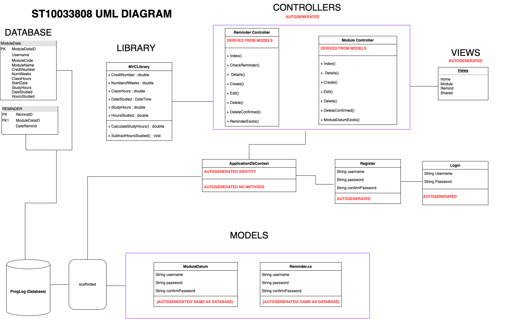

# TaskTracker: Optimizing Your Academic Journey

  

## Table of Contents

- [TaskTracker: Optimizing Your Academic Journey](#tasktracker-optimizing-your-academic-journey)
   - [Description](#tasktracker-description)
  - [Features](#features)
  - [Non-Functional Requirements](#non-functional-requirements)
  - [Getting Started](#getting-started)
  - [Dependencies](#dependencies)
  - [Installation](#installation)
  - [Usage](#usage)
  - [Roadmap](#roadmap)
  - [Contributing](#contributing)
  - [Authors](#authors)
  - [License](#license)
  - [Acknowledgments](#acknowledgments)
  - [Code Attribution](#code-attribution)

## TaskTracker Description

Welcome to **TaskTracker**, a state-of-the-art desktop application meticulously crafted to redefine the way you navigate your academic journey. Developed with precision using the cutting-edge MVC ASP.NET CORE WEB APPLICATION framework, TaskTracker isn't just a tool; it's your indispensable companion for achieving academic excellence.

**Key Highlights:**
- **Intuitive Interface:** Immerse yourself in a user-friendly experience that seamlessly integrates into your daily routine. TaskTracker's intuitive interface simplifies time management, ensuring that you can effortlessly navigate through its features and functionalities.

- **Robust Data Persistence:** Your academic journey is important, and so is the data associated with it. TaskTracker employs a secure SQL database, providing robust data persistence. Your valuable information is stored with the utmost reliability, ensuring easy retrieval whenever you need it.

- **User Authentication:** Privacy and data integrity are paramount. TaskTracker prioritizes these concerns with a robust user authentication system. Rest assured that only authorized users have access, safeguarding your academic data from unauthorized access.

TaskTracker goes beyond conventional task management. It empowers you to take control of your academic life, offering a suite of features designed to help you organize, plan, and optimize your study habits. Whether you're managing assignments, staying on top of deadlines, or crafting effective study schedules, TaskTracker is your ally in navigating the complex landscape of coursework and academic commitments.

With TaskTracker, academic success becomes not just a goal but a tangible reality. Elevate your educational experience, stay ahead in your coursework, and confidently tackle your academic challenges with TaskTracker by your side.

  ## Tutorial
Click the button below to watch a tutorial video.

  

  OR (preferrably for quality)

## Features

### 1. Add Modules
- Effortlessly add and organize multiple modules for the semester.
- Capture crucial details: Code, Name, Credits, Class hours per week.

### 2. Set Semester Duration
- Customize your academic timeline with the ability to set the number of weeks and start date.

### 3. Calculate Self-Study Hours
- TaskTracker dynamically calculates and displays weekly self-study hours for each module.
- Formula: Self-study hours per week = (Credits * 10) / Number of weeks - Class hours per week.

### 4. Record Study Hours
- Easily log the number of hours spent on specific modules and dates.

### 5. Track Remaining Self-Study Hours
- Stay informed with real-time updates on remaining self-study hours for each module.

### 6. Data Persistence
- Your data is securely stored in an SQL database, ensuring accessibility across sessions.
- User authentication adds an extra layer of security.

## Non-Functional Requirements

### 1. Coding Standards and Comments
- TaskTracker adheres to internationally acceptable coding standards.
- Comprehensive comments provide insights into variable names, methods, and programming logic.

## Getting Started

Get up and running with TaskTracker in a few simple steps:

1. **Clone the Repository:** Download the repository to your local machine.
2. **Open in Visual Studio:** Launch the solution in Visual Studio.
3. **Database Setup:** Create the database in SSMS and obtain the connection string in Visual Studio.
4. **Build the Solution:** Ensure all dependencies are resolved.
5. **Configure Connection String:** Add the connection string configuration.
6. **Configure Library:** Open up the MVCLibrary.sln provided to you here on Github then build it.
7. **Add Library:** Right-click on dependancies and press 'Add' then select the MVCLibrary.dll.
8. **Run the Application:** Fire up the application and dive into efficient time management.

## Dependencies

TaskTracker relies on the following technologies and libraries:

- .NET Framework
- MVC ASP.NET CORE WEB APPLICATION
- LINQ (Language Integrated Query)
- Entity Framework Core for database access

## Installation

Install TaskTracker locally by following these steps:

1. **Download the [latest release](https://github.com/VCDBN/prog6212-poe-Leighche.git).**
2. **Run the Installer:** Follow the installation wizard.
3. **Launch Application:** Once installed, easily launch TaskTracker from your Start menu.

## Usage

Efficiently leverage TaskTracker for optimal time management:

1. **Access the Application:** Type the website link in your web browser and launch the application.
2. **Registration/Login:** Securely register or log in with your credentials.
3. **Add Modules:** Populate your semester with modules.
4. **Set Duration:** Customize your semester timeline.
5. **Record Study Hours:** Log your study hours effectively.
6. **Monitor Remaining Hours:** Stay updated on remaining self-study hours for each module.
7. **Set Reminders:** Enhance your productivity with timely study reminders.

## UML

## Change Log

In this significant update, TaskTracker has undergone substantial improvements and introduced several key changes:

### Framework and Interface Overhaul:

- **Transition from WPF to MVC ASP .NET Core:**
  - TaskTracker has evolved from using WPF to adopting the MVC ASP .NET Core web application framework, leveraging the latest .Net 8.0 technology. This transition enhances performance, scalability, and modernizes the application's architecture.

- **Updated User Interface:**
  - The application's interface has been completely redesigned to provide a more user-friendly and minimalistic aesthetic. The navigation has shifted from a side panel to a sleek navigation bar that seamlessly switches between pages, each with its own controllers. This approach enhances the user experience and makes navigation more intuitive.

- **Multi-Language Support:**
  - TaskTracker now utilizes a combination of C#, JavaScript, CSS, and HTML5 to bring a dynamic and visually appealing interface to life. This multi-language approach optimizes design elements and enriches the overall user interaction.

### Enhanced Functionality:

- **Reminders Functionality:**
  - A notable addition to TaskTracker is the introduction of a reminders function. Users can now set reminders for specific modules on designated dates, enhancing the application's utility by promoting effective time management and study planning.

### Library and Calculations Optimization:

- **Streamlined C# Library:**
  - TaskTracker now employs a more efficient and focused C# library to handle essential calculations within the MVC application. This streamlined library ensures optimal performance and code convenience.

### Database and UML Updates:

- **Revamped Database Structure:**
  - The database has undergone a significant overhaul, adopting a simpler structure compared to Version 2. Stored procedures have been eliminated, reflecting the streamlined nature of MVC. The emphasis is now on individual accounts for logging processes.

- **Reminders Table:**
  - A new addition to the database is the reminders table, aligning with the application's new reminders functionality. This table allows users to create reminders for specific modules on specific dates, enhancing the application's versatility.

### Overall Efficiency and User Experience:

- **Efficiency and Code Convenience:**
  - The changes made, including the streamlined library and optimized database structure, contribute to improved efficiency and code convenience, ensuring a smoother and more responsive user experience.

TaskTracker Version 3.0 marks a transformative step forward, embracing modern technologies and refining functionality to better meet the needs of users striving for academic success.

## Roadmap

Exciting plans are in store for TaskTracker's future:

- **Cloud Integration:** Further integration with cloud services for enhanced accessibility.

## Contributing

Contribute to the evolution of TaskTracker! Follow our [Contribution Guidelines](CONTRIBUTING.md).

## Authors

- **Leighché Jaikarran**

## License

This project is licensed under the MIT License - see the [MIT LICENSE](LICENSE) file for details.

## Acknowledgments

Gratitude to individuals and resources contributing to or inspiring this project:

- **Denzyl Govender:** Invaluable guidance and support.

## Code Attribution

Database first approach in ASP.NET Core 6 Complete CRUD Operation - Noor Codelogic. 2022. Youtube video, added by Noor Codelogic. [Online]. Available at: 
https://youtu.be/zQLdpm8icTw?si=mR0t9d4_z54mPQ2P  
[Accessed 28 November 2023].

Farrell, J. 2017. Visual C# 2017: An Introduction to Object-Oriented Programming. 7th Edition. Cengage Publishing.

 

  

